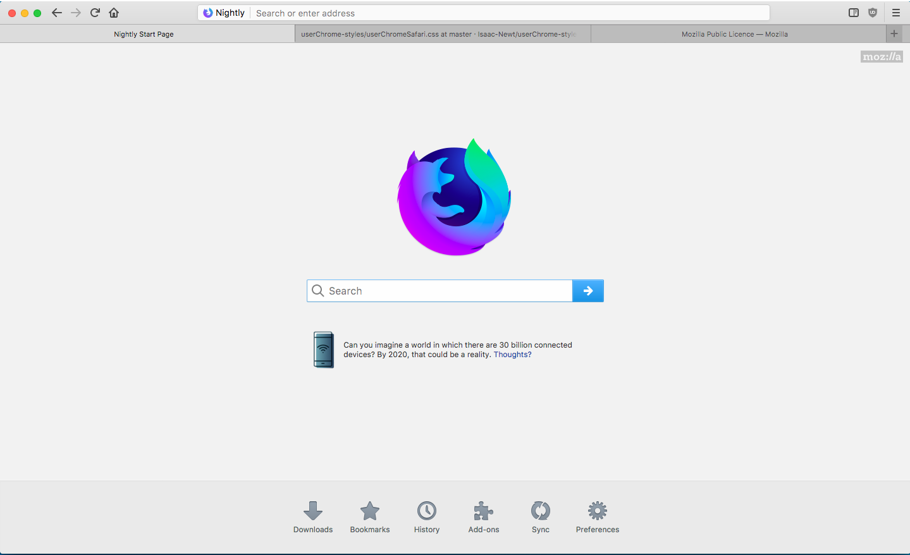
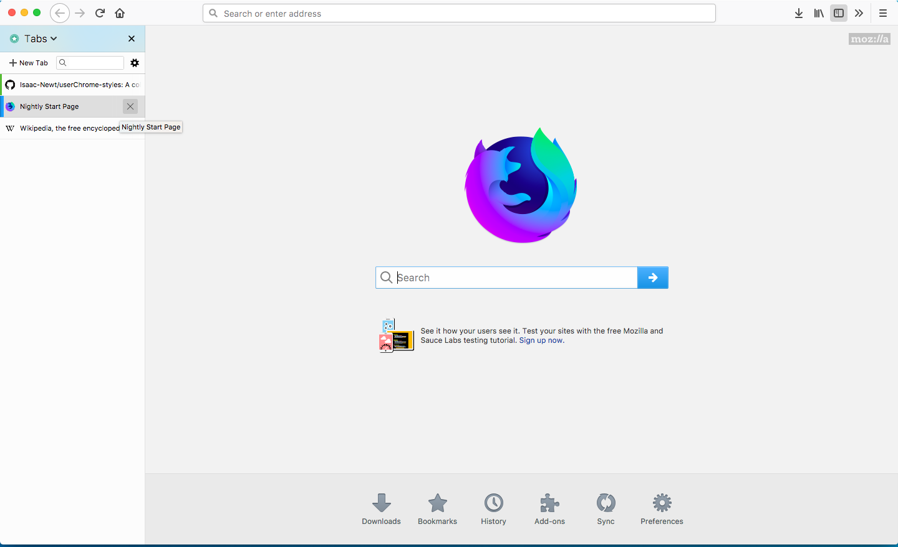

# Firefox userChrome.css Styles
A collection of userChrome.css styles for Firefox.  Recommended for Firefox 57+

## Index
### Full (ish) themes
  - [Safari](https://github.com/Isaac-Newt/userChrome-styles#safari)
### UI Modifications (less complex)
  - [Tabs on Bottom](https://github.com/Isaac-Newt/userChrome-styles#tabs-on-bottom)
  - [Hide Tab Bar](https://github.com/Isaac-Newt/userChrome-styles#hide-tab-bar)
### Tiny Tweaks (Just little things, usually compliment other styles)
  - [Tab Center Redux Tweaks](https://github.com/Isaac-Newt/userChrome-styles#tab-center-redux-tweaks)
---

[Safari](https://github.com/Isaac-Newt/userChrome-styles/blob/master/Styles/userChromeSafari.css)
---
Imitates the style of Safari on MacOS. Currently tested on MacOS, should work on Linux and Windows without much issue.

---

[Tabs On Bottom](https://github.com/Isaac-Newt/userChrome-styles/blob/master/Styles/userChromeBottom.css)
---
Simply moves tabs to the bottom.

[Hide Tab Bar (Tabs in sidebar)](https://github.com/Isaac-Newt/userChrome-styles/blob/master/Styles/userChomeHideTabs.css)
---
Hides tab bar.  For use with addons like Tab Center Redux, Tree Tabs, Sea Containers, etc.

---

[Tab Center Redux Tweaks](https://github.com/Isaac-Newt/userChrome-styles/tree/master/Styles/Tab%20Center/userChromeTabCenter.css)
---
Hides the sidebar header and auto-minimizes the sidebar, similar to the original Tab Center behavior.  

Tested on Linux, works ok on MacOS (no shadow on hover)

